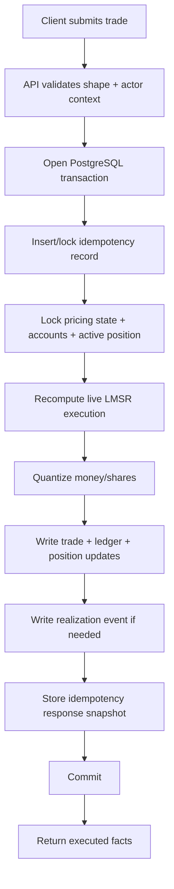
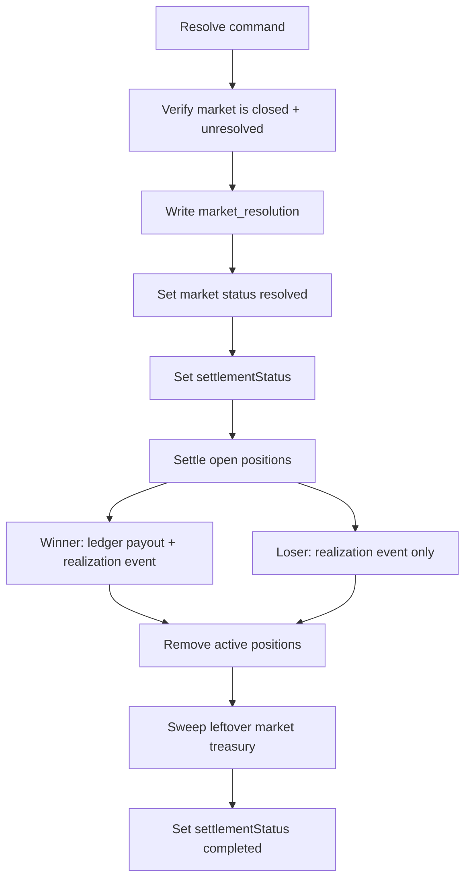

# Backend Overview

Updated: 2026-05-27
Status: current
Owner: backend lane

Purpose:
- explain the backend in plain language
- help new sessions start without archaeology
- map backend layers, backend structure, and the mental model behind them

Read with:
- `systems/back/docs/README.md`
- `systems/back/docs/current-status.md`
- `systems/back/docs/v1-contract-brief.md`
- `systems/back/docs/market-engine.md`
- `systems/back/docs/engine-decisions.md`
- `systems/back/docs/horizon/README.md`
- `systems/back/docs/control-plane/README.md`
- `workspace/docs/agents/oracle/README.md`
- `ARCHITECTURE.md`
- `SECURITY.md`

This doc is not:
- the status board
- the historical memo pile
- the exact API contract reference

Exact route contract map:
- `workspace/tasks/reference/current-backend-api-map.md`

This doc owns:
- backend layer map
- runtime/module shape
- money/trade/resolution orientation

This doc does not own:
- live runtime status
- app-facing contract detail
- auth/session policy
- backend archaeology

## Backend: Current Layers

### 1. Core Engine

Owns:
- pricing math
- trade execution
- positions
- accounts
- ledger
- settlement

Tone:
- deterministic
- boring
- trusted

### 2. Market Management / Lifecycle

Owns:
- draft creation/editing
- publish command
- admin lifecycle controls
- semantic prep before a market goes live
- Seer materialization handoff
- Horizon close commands

### 3. Control Plane

Owns:
- auth/session
- Google OAuth and email OTP identity paths
- production session gates
- current-user reads
- user lifecycle and admin user controls

### 4. Oracle / Resolution

Owns:
- event-status checking
- evidence gathering
- early-close or resolve proposals
- human-approval hooks for ambiguous cases

### 5. Discovery / Search

Owns:
- product-facing discovery feed reads
- search reads
- market-card preview shaping
- viewer-position read hints

### 6. Seer Boundary

Owns:
- market-supply proposals in `systems/seer/`
- creation drafts
- backend materialization/publish handoff through backend scripts/services

Does not own:
- product Discovery UI
- trusted publish authority
- Oracle resolution truth

Rule:
- Seer suggests market supply
- product Discovery helps users find markets
- management prepares/publishes
- Oracle proposes truth transitions
- human oversight confirms sensitive cases
- engine enforces

## Runtime Architecture

One modular backend service.

Core pieces:
- Node.js + TypeScript runtime
- PostgreSQL source of truth
- Fastify-owned HTTP API
- domain services
- SQL migrations
- seed path
- Fastify route-family registration
- in-memory route-family rate-limit gate attached at the HTTP boundary, including
  a fallback bucket for unmatched API requests and a catch-all admin bucket
- shared IP-level stream connection limiter for long-lived SSE routes

Not the goal:
- microservices
- queue empire
- event-bus drama
- mandatory worker split

## Backend Module Map

Current code-owned module families:
- `systems/back/src/config/`
  - env loading
  - runtime config
- `systems/back/src/http/`
  - `app.ts`
  - `fastify-app.ts`
  - `json.ts` for CORS/SSE raw-response compatibility helpers
  - `health.ts`
  - `rate-limit.ts`
  - `request-metrics.ts`
  - `routes/market-detail.ts` and `routes/market-detail-fixtures.ts`
  - SSE market stream helpers
- `systems/back/src/auth/`
  - actor resolution
  - session cookies
  - Google OAuth
  - email OTP challenge/session spine
  - current-user and admin-user services
- `systems/back/src/db/`
  - `client/`
  - `tx/`
  - read models
  - `readiness.ts`
- `systems/back/src/engine/`
  - `pricing/`
  - `trading/`
  - `portfolio/`
- `systems/back/src/lifecycle/`
  - `horizon/`
  - `management/`
- `systems/back/src/markets/`
  - public market reads
  - market-history candles/sampling
  - live-count
- `systems/back/src/discovery/`
  - discovery feed query/ranking/presenter
- `systems/back/src/search/`
  - public search
- `systems/back/src/shared/`
  - `decimals/`
  - audit/lifecycle events
  - market identity/truth/category helpers
  - logger
- `systems/back/src/scripts/`
  - migrations, seed/reset, smoke, gauntlet, Horizon, Oracle, Seer materialization

Current real runtime slices also include:
- `systems/back/src/lifecycle/horizon/`
  - close contracts
  - legality checks
  - close execution
  - CLI-first sweep/inspect layer
- `systems/oracle/src/`
  - Oracle CLI/runtime code, invoked through backend scripts/toolchain

Important:
- keep `http/` naming because the runtime scaffold already uses it
- do not rename health/logging files for architecture purity theatre
- let new backend truth land in the owning module family, not inside HTTP handlers

## Core Data Model Map

Source-truth tables:
- `markets`
- `market_outcomes`
- `market_pricing_state`
- `market_outcome_state`
- `accounts`
- `ledger_transactions`
- `ledger_entries`
- `trades`
- `positions`
- `realization_events`
- `market_resolutions`
- `idempotency_records`
- `audit_events`
- `sessions`
- `otp_challenges`
- `user_identities`
- `oracle_cases`
- `oracle_runtime_snapshots`
- `market_history_candles`
- `lifecycle_events`
- `portfolio_claims`

Derived/cached later:
- portfolio snapshot cache
- market summary cache
- richer settlement batches

## Money Map

Actors:
- `user_cash`
- `market_treasury`
- `platform_treasury`
- `mint_source`
- `sink`

Normal flows:
- `mint_source -> platform_treasury`
- `platform_treasury -> market_treasury`
- `platform_treasury -> user_cash`
- `user_cash -> market_treasury`
- `market_treasury -> user_cash`
- `market_treasury -> platform_treasury` after full settlement

Important:
- LMSR sets prices
- treasury carries money consequences
- ledger records money movement only
- loser closeout uses realization events, not fake zero-money ledger rows

## Trade Flow Map

## Resolution Flow Map

## How To Use This Doc

Use this doc when you need:
- backend mental model
- layer ownership
- module map
- money/trade/resolution orientation

Do not use this doc as:
- the “what is live right now?” board
- the historical memo pile
- the exact API contract reference

For those:
- `systems/back/docs/README.md`
- `systems/back/docs/current-status.md`
- `systems/back/docs/v1-contract-brief.md`
- `workspace/tasks/reference/current-backend-api-map.md`
- `systems/back/docs/control-plane/README.md`
- `systems/back/docs/history/`

## Short Rule

Backend should feel like:
- one trusted spine
- clear layer boundaries
- explicit money movement
- minimal magic

If something starts feeling clever, probably wrong.
